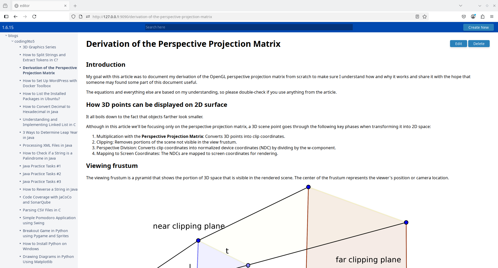

# notes-app

## About

A simple 📝 note taking app.

I use this tool as my personal knowledge base/notes application.

⚠️ Notes:
1. If you use this tool, always make a backup of your content.
1. This tool is meant to run locally. Do not expose it to to the internet as there is no authentication implemented, this is a private tool, 

## Features

- Posts are written in Markdown
- No database (only markdown files)
- Posts can be organized hierarchically
- 🔍 Search (a simple inverted index method that works perfectly for a few hundred posts)
  - Regular search (tokens are OR-ed)
  - Exact phrase search using quotes

## Usage

1. `mkdir content`
1. `npm i`
1. `npm run start`

Thee defualt port the app listens on is 9090. The default directory the app is looking for content is `content`. Both parameters can be changed in the `package.json` file.

